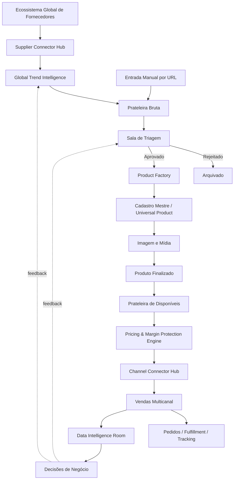

# DDF — Visão e Fluxo Operacional

## Objetivo
A Dioli Dropshipping Factory (DDF) é uma plataforma central de descoberta, seleção, industrialização digital, precificação, distribuição e inteligência de produtos de dropshipping. O núcleo não pertence a fornecedor, marca ou marketplace específico.

## Fluxo mestre

## Estados canônicos do produto
CANDIDATO → TRIADO → APROVADO → EM_PRODUCAO → PRONTO → PRECIFICADO → PUBLICADO. Estados adicionais: REJEITADO, ARQUIVADO, PAUSADO, BLOQUEADO.

## Princípios
1. Produto candidato deve permanecer barato: nenhuma industrialização cara antes da aprovação.
2. Master Product é separado de Supplier Offer: um produto canônico pode possuir várias ofertas/fornecedores.
3. Marca não determina canal. Santioh, Dilee, Dilix e Queise podem usar qualquer canal suportado conforme estratégia.
4. Preço é específico por marca/canal/oferta quando necessário; não existe obrigação de um preço universal.
5. Toda automação financeira deve proteger margem antes de proteger volume.
6. Toda integração externa deve ser feita por adaptadores/conectores, preservando o núcleo da DDF.
7. Toda decisão, sincronização e alteração crítica deve ser auditável.
8. Esta especificação define objetivos e comportamento; a escolha dos agentes/modelos de IA pertence à Control Room.