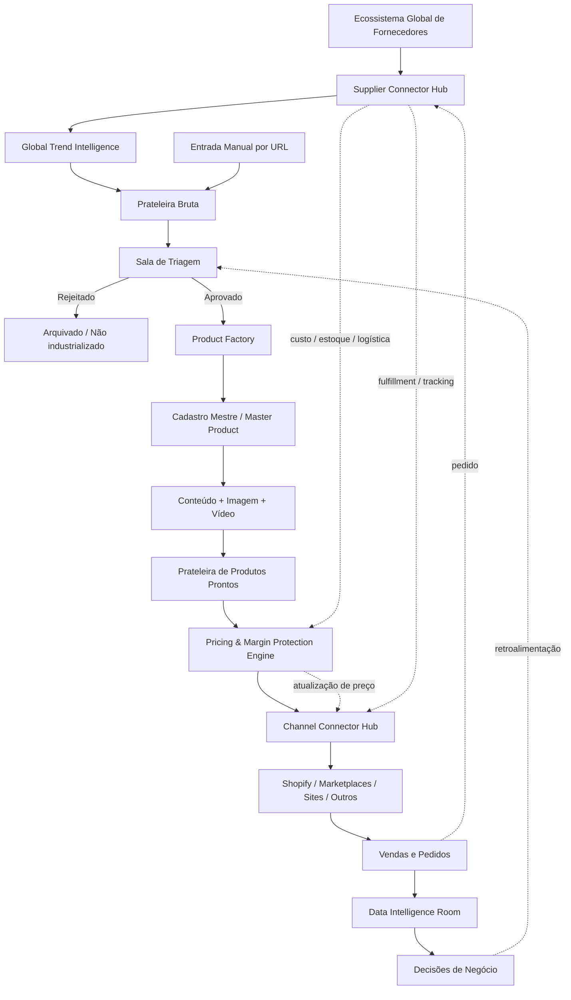

# DDF — Dioli Dropshipping Factory

> **Status:** Blueprint funcional v1 — especificação para arquitetura e construção pela Control Room.

## REGRA DE ISOLAMENTO

Este diretório representa um **projeto novo**. O conteúdo, código, arquitetura e decisões existentes fora de `DDF-BLUEPRINT/` pertencem ao MVP/legado anterior e **NÃO constituem especificação da DDF**.

A construção da nova DDF não deve inferir requisitos a partir do legado, reaproveitar arquitetura antiga por conveniência, nem misturar os dois projetos sem decisão explícita posterior. O legado pode permanecer no repositório, mas a fonte de verdade funcional da nova DDF será este blueprint.

## Nome canônico

**DDF — Dioli Dropshipping Factory**

## Objetivo

Construir uma fábrica central de produtos de dropshipping capaz de descobrir ou receber produtos, fazer pré-curadoria barata, aprovar seletivamente o que merece investimento, industrializar cada produto em um cadastro mestre extremamente rico, proteger margem, distribuir para múltiplas marcas e canais, sincronizar fornecedores/pedidos/preços e transformar os resultados reais de venda em inteligência de negócio.

## Fluxo operacional mestre

## Princípios já aprovados

1. **Candidato não é produto industrializado.** Descobrir e armazenar um candidato deve ser barato. Processamento sofisticado só começa após aprovação.
2. **Duas entradas para a Prateleira Bruta:** Global Trend Intelligence e entrada manual por URL por usuário autorizado.
3. **O Cadastro Mestre é o coração da Factory.** Deve ser um superset amplo dos campos necessários aos marketplaces/canais suportados, não um cadastro limitado a um canal.
4. **Master Product é separado de Supplier Offer.** Um mesmo produto Factory pode ter múltiplos fornecedores/ofertas com custo, estoque, frete e prazo distintos.
5. **Não existe um único preço de venda.** A precificação é específica por produto + marca/loja + canal, conforme regras aplicáveis.
6. **Proteção de margem é missão crítica.** Mudanças em fornecedor, frete, câmbio, impostos, tarifas, comissões e outros custos devem recalcular de forma controlada os destinos afetados.
7. **Fornecedor e canal são desacoplados do núcleo.** Supplier Connector Hub e Channel Connector Hub traduzem sistemas externos para/de um modelo interno universal.
8. **Marca não determina canal.** Santioh, Dilee, Dilix e Queise podem usar qualquer canal tecnicamente suportado conforme estratégia comercial; algumas marcas podem ter distribuição seletiva e outras ampla.
9. **Trends olha para fora; Data Intelligence olha para dentro.** A primeira encontra sinais e oportunidades globais/locais; a segunda mede o que realmente acontece na operação.
10. **A decisão cara é protegida.** A entrada manual não depende da aprovação do Trends, mas entra normalmente na triagem antes de consumir processamento caro.
11. **Arquitetura de agentes de IA está fora deste blueprint.** Este material define objetivos, responsabilidades, entradas, regras e saídas. A Control Room decidirá posteriormente quais agentes/modelos executarão cada função.
12. **Identidade visual está fora do escopo desta fase.** Estrutura e comportamento vêm primeiro.

## Estados mínimos do ciclo do produto

`CANDIDATO → TRIADO → APROVADO → EM_PRODUCAO → PRONTO → PRECIFICADO → PUBLICADO`

Estados auxiliares/exceções deverão existir para rejeição, arquivamento, erro, quarentena, suspensão e despublicação, sem apagar histórico.

## Marcas conhecidas no lançamento

- **Santioh**
- **Dilee**
- **Dilix**
- **Queise**

Essas marcas são destinos comerciais, não silos arquiteturais. Novas marcas devem ser adicionáveis sem reconstruir o núcleo da DDF.

## Regra de especificação por módulo

Cada módulo detalhado neste blueprint deverá declarar, no mínimo:

- objetivo e razão de existir;
- responsabilidades e limites;
- entradas;
- processamento/regras de negócio;
- saídas;
- estados/transições;
- dependências e integrações;
- dados que precisam ser persistidos;
- falhas, exceções e salvaguardas;
- observabilidade/auditoria necessária;
- critérios de aceite.

## Diretriz para a Control Room

Não iniciar a implementação interpretando apenas este README como especificação completa. Ele é o mapa mestre. Os documentos funcionais detalhados deste diretório deverão ser lidos em conjunto antes da definição da arquitetura técnica e do plano de execução.
